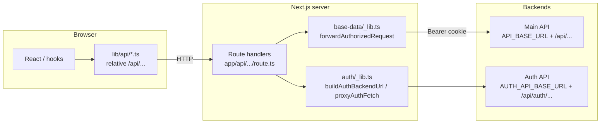

# Admin app — API request architecture

This document explains how HTTP requests are built end-to-end: from the browser, through **Next.js Route Handlers** (the BFF / proxy layer), to the **backend services**, and how that differs from **auth** flows.

---

## 1. Why a proxy at all?

The Admin UI runs in the browser. The real backend URLs and access tokens should not be the only line of defense, but we also want:

- **HttpOnly cookies** for tokens after login (JavaScript on the page cannot read them).
- A **stable, same-origin** API for the frontend: `/api/...` on the Next app (e.g. `http://localhost:3001`), so the browser does not need CORS to talk to a separate host for app features.
- **Server-side** calls to the real backend with secrets resolved from env (never baked into client bundles for server-only values).

So the pattern is:

1. **Browser** → `fetch("/api/...")` on the Admin origin (relative URLs).
2. **Next.js Route Handler** (`app/api/**/route.ts`) → `fetch(<backend URL>)` with the right headers/body.
3. **Backend** responds; the route handler forwards JSON (and for auth, sets cookies).



---

## 2. Environment variables

Configured in **`.env.local`** (or deployment env). **`.env.example` is not loaded by Next.js** — copy it to `.env.local` for local development.

| Variable | Role |
|----------|------|
| `API_BASE_URL` | Origin of the **main** REST API (regions, clusters, federations, user profile, etc.). |
| `AUTH_API_BASE_URL` | Origin of the **authentication** service (login, refresh, OTP, etc.). |
| `AUTH_API_PREFIX` | Fixed in code as `/api/auth` — auth routes on that host live under this prefix. |

Defaults and resolution live in [`lib/auth.ts`](./lib/auth.ts). `API_BASE_URL` falls back to `AUTH_API_BASE_URL` if unset, so one host can serve both if your deployment does.

---

## 3. Two ways to build backend URLs

Shared helpers live in [`app/api/auth/_lib.ts`](./app/api/auth/_lib.ts) (used by both auth and non-auth code).

### 3.1 Main API — `buildBackendUrl(pathname)`

- **Base:** `API_BASE_URL` (no extra prefix in code beyond what you put in `pathname`).
- **Convention:** Pass paths that match the backend, including the `/api/...` segment, e.g. `/api/region`, `/api/user/me`.

```text
Final URL = <API_BASE_URL> + pathname
Example:  http://161.97.171.189:8034 + /api/region  →  http://161.97.171.189:8034/api/region
```

### 3.2 Auth API — `buildAuthBackendUrl(pathname)`

- **Base:** `AUTH_API_BASE_URL`
- **Prefix:** `AUTH_API_PREFIX` (`/api/auth`)
- **Convention:** Pass only the **auth route segment**, e.g. `"/login"` → `/api/auth/login`.

```text
Final URL = <AUTH_API_BASE_URL> + /api/auth + pathname
Example:  http://161.97.171.189:8034 + /api/auth + /login
```

---

## 4. “Base data” and everything that uses `forwardAuthorizedRequest`

[`app/api/base-data/_lib.ts`](./app/api/base-data/_lib.ts) defines the core pattern for **authenticated** main-API calls.

### 4.1 `forwardAuthorizedRequest({ path, method, body })`

1. Reads the **access token** from the **HttpOnly cookie** `weema_access_token` (see [`lib/auth.ts`](./lib/auth.ts)).
2. If missing → **401** JSON to the browser (no backend call).
3. Otherwise → `fetch(buildBackendUrl(path), { method, Authorization: Bearer <token>, ... })`.
4. Parses JSON with `safeJson` and returns `NextResponse.json(payload, { status })` — **same status** as the backend.

So `path` must be the **full backend path** as the main API expects it (typically starting with `/api/`).

### 4.2 `buildPathWithQuery(request, basePath)`

For **GET** list endpoints, the browser’s query string (pagination, filters) must reach the backend. The handler passes the incoming `Request` and a `basePath` like `/api/region`; this helper appends `?...` from the **browser’s** URL so filters are forwarded unchanged.

### 4.2b `forwardAuthorizedFormDataRequest` (multipart)

For **POST** endpoints that expect **`multipart/form-data`** (e.g. member create with national ID file), the Route Handler reads `request.formData()` and forwards it with `Authorization: Bearer <token>` **without** setting `Content-Type` (the fetch boundary must be set automatically). See [`app/api/base-data/_lib.ts`](./app/api/base-data/_lib.ts).

Multipart proxy uses **`AbortSignal.timeout`** — default **120s** (`API_PROXY_UPLOAD_TIMEOUT_MS` in `.env.local`). If the main API does not respond in time, the browser gets **504** with `code: UPLOAD_PROXY_TIMEOUT` (this is the **Next** hop timing out, not the backend’s own error JSON).

Debug lines **`[api-proxy] -> multipart …`** / **`<-`** / **`!!`** print in the **server terminal** when `NODE_ENV === "development"` or `AUTH_DEBUG=1` (same as auth proxy logging).

### 4.3 Resources using this pattern

These Route Handlers all forward to **`API_BASE_URL`** with a **Bearer** token:

| Next route (browser calls) | Typical backend `path` (examples) |
|----------------------------|-----------------------------------|
| `/api/region`, `/api/region/[id]` | `/api/region`, `/api/region/:id` |
| `/api/zone`, `/api/zone/[id]` | `/api/zone`, … |
| `/api/woreda`, `/api/woreda/[id]` | `/api/woreda`, … |
| `/api/kebele`, `/api/kebele/[id]` | `/api/kebele`, … |
| `/api/religion`, `/api/religion/[id]` | `/api/religion`, … |
| `/api/federation`, `/api/federation/[id]`, … | `/api/federation`, nested `/api/federation/:id/clusters`, … |
| `/api/cluster`, `/api/cluster/[id]`, … | `/api/cluster`, `/api/cluster/:id/self-help-groups`, … |
| `/api/self-help-group`, `/api/self-help-group/[id]` | `/api/self-help-group`, … |
| `/api/member`, `/api/member/[id]` | `/api/member` (GET list; POST multipart create), `/api/member/:id` (GET/PATCH/DELETE) |
| `/api/member/[id]/national-id` | `POST` multipart `file` → `/api/member/:id/national-id` |
| `/api/user/me` | `/api/user/me` |

Nested examples:

- `POST /api/federation/[id]/clusters` → `POST` to `/api/federation/:id/clusters` with body from the client.
- `POST /api/cluster/[id]/self-help-groups` → link SHGs to a cluster.
- `DELETE` on federation/cluster SHG routes → unlink.

The **browser never constructs `API_BASE_URL`**. It only uses **relative** paths like `/api/region?page=1`.

---

## 5. Browser-side clients (`lib/api`)

Server routes are mirrored by **client modules** that call **`/api/...` on the same origin**:

| Module | Responsibility |
|--------|----------------|
| [`lib/api/base-data.ts`](./lib/api/base-data.ts) | Region, zone, woreda, kebele, religion — list/create/update/delete via `/api/...`. |
| [`lib/api/community.ts`](./lib/api/community.ts) | Federation, cluster, SHG — same idea; query strings built with `buildQueryString` (e.g. `page`, `page-size`, `search-query`). |
| [`lib/api/members.ts`](./lib/api/members.ts) | Members — list (GET + filters), create (`FormData` multipart), `PATCH`/`DELETE`, national ID upload (`FormData` with `file`). |
| [`lib/api/user.ts`](./lib/api/user.ts) | `GET /api/user/me` for the current profile. |

**Important:** These `fetch` calls rely on **cookies being sent** for same-origin requests (default `credentials` behavior for same-origin). The access token is **not** read in JS; the server route reads the cookie and adds `Authorization`.

**Auth** flows (login, logout, refresh, OTP) use **`@weema/auth`** and **`/api/auth/...`** — see section 6.

---

## 6. Auth routes (different base path and cookies)

Auth Route Handlers under `app/api/auth/**` use **`buildAuthBackendUrl`** and often **`proxyAuthFetch`** (see [`app/api/auth/_lib.ts`](./app/api/auth/_lib.ts)):

| Browser path | Role |
|--------------|------|
| `POST /api/auth/login` | Body: email/password → backend login; on success sets **HttpOnly** access + refresh cookies; may enforce admin-eligible role. |
| `POST /api/auth/refresh` | Uses refresh cookie to get new tokens. |
| `POST /api/auth/logout` | Clears cookies; optionally notifies backend. |
| `PATCH /api/auth/request-otp/[email]`, `GET .../verify-otp/...`, `POST /api/auth/reset-password` | Password recovery flow. |

The **`@weema/auth`** package’s `createAuthApiClient` is configured with **`baseUrl: "/api/auth"`** from the client so login hits the **Next** route, not the raw backend.

Debug logging for auth proxy traffic (development or `AUTH_DEBUG=1`) is described in comments inside `app/api/auth/_lib.ts`.

---

## 7. End-to-end example (base data)

1. **UI** calls `getRegions()` in [`lib/api/base-data.ts`](./lib/api/base-data.ts) → `GET /api/region?page=1&page-size=10&...`
2. **Route** [`app/api/region/route.ts`](./app/api/region/route.ts) runs `forwardAuthorizedRequest` with `path: buildPathWithQuery(request, "/api/region")`.
3. **Server** requests `GET ${API_BASE_URL}/api/region?...` with `Authorization: Bearer <cookie token>`.
4. **Response** JSON is passed back to the browser with the same status.

---

## 8. Security notes (short)

- **Main API:** Token never exposed to JS — only the server reads `weema_access_token` and forwards `Bearer`.
- **Login:** Password is sent to **`/api/auth/login`** only over your app’s HTTPS in production; the Route Handler forwards to the auth service.
- **Role checks:** Login route can reject users whose role is not allowed for Admin (see `@weema/auth` and `isAllowedAdminRole` in the login route).

---

## 9. File map (quick reference)

| Concern | Location |
|---------|----------|
| Env + cookie names | `lib/auth.ts` |
| Main vs auth URL builders + auth proxy logging | `app/api/auth/_lib.ts` |
| Authenticated BFF to main API | `app/api/base-data/_lib.ts` |
| Auth BFF routes | `app/api/auth/*/route.ts` |
| Main BFF routes | `app/api/{region,zone,...,federation,cluster,self-help-group,user}/**/route.ts` |
| Browser fetch wrappers | `lib/api/base-data.ts`, `community.ts`, `members.ts`, `user.ts` |
| React Query hooks | `hooks/*.ts` (call into `lib/api`) |

---

## 10. Adding a new main-API endpoint

1. Add a Route Handler under `app/api/...` that calls `forwardAuthorizedRequest` with the **exact** backend path your API exposes (including `/api/...`).
2. For GET lists with query params, use `buildPathWithQuery`.
3. Add functions in `lib/api/` that `fetch("/api/...")` from the browser.
4. Ensure `.env.local` has the correct `API_BASE_URL` (and auth env if needed).

This keeps one consistent pattern: **browser → same-origin `/api` → server → `API_BASE_URL`**.
